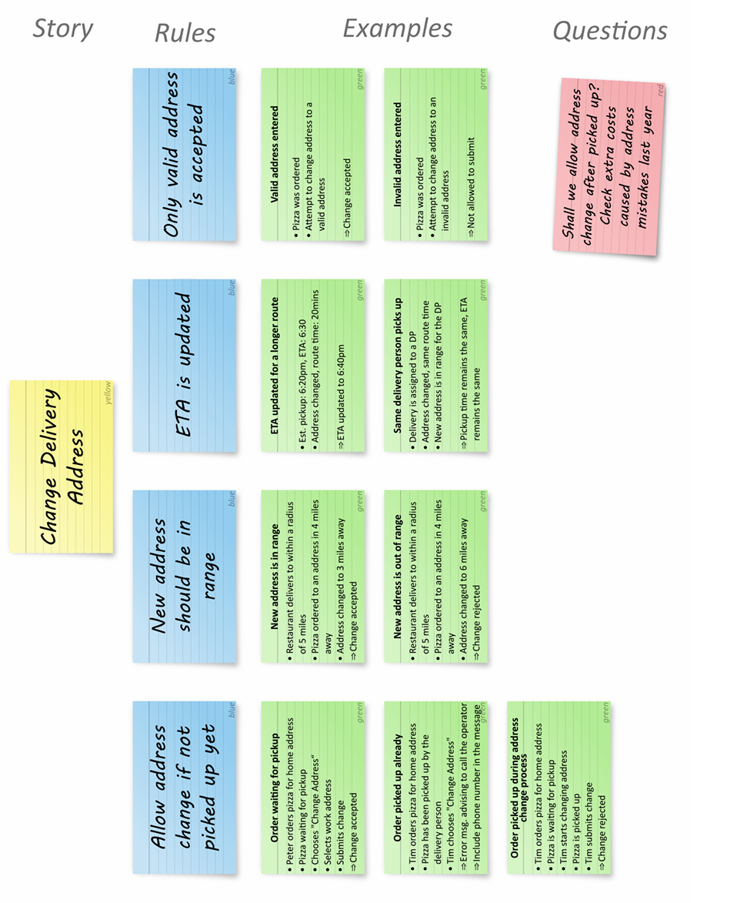

# BDD Books – *Discovery: Explore Behaviour Using Examples*  
## Capítulo 2 – Structured Conversation

### Introducción

En el desarrollo de software, una de las mayores causas de fracaso es la **falta de entendimiento compartido** entre quienes construyen el sistema y quienes lo necesitan.  
El objetivo de las **conversaciones estructuradas** en *Behaviour-Driven Development (BDD)* es alinear ese entendimiento mediante ejemplos concretos y lenguaje común.

---

## 1. Qué es una conversación estructurada

Una **conversación estructurada** es un diálogo planificado entre las personas que participan en el desarrollo de un producto:  
- Negocio  
- Analistas  
- Testers  
- Desarrolladores  

Su propósito es **descubrir y aclarar comportamientos** del sistema antes de escribir código.  
A diferencia de las conversaciones informales, este tipo de diálogo sigue una estructura que ayuda a evitar ambigüedades y malentendidos.

> “Si no tenemos una comprensión compartida, es muy probable que construyamos algo que no era lo que el cliente necesitaba.”

---

## 2. Estructura de la conversación

Las conversaciones efectivas suelen organizarse en tres fases:

### a. Descubrimiento (Discovery)
Se busca identificar qué comportamiento del sistema se está discutiendo y **por qué es importante**.  
- Se formulan preguntas abiertas.  
- Se identifican objetivos, reglas y casos límite.  
- Se buscan ejemplos que describan situaciones reales.

### b. Ilustración (Illustration)
Se eligen los ejemplos más representativos y se los transforma en **escenarios de comportamiento** concretos.  
Estos ejemplos ayudan a expresar el requisito en un **lenguaje compartido** que tanto el negocio como los desarrolladores entienden.

### c. Formalización (Formulation)
Los ejemplos seleccionados se documentan de forma estructurada, normalmente como **escenarios ejecutables** (por ejemplo, con Gherkin).  
Esta documentación sirve luego para pruebas automatizadas o guías de implementación.

---

## 3. El rol de los ejemplos

Los ejemplos son el **núcleo del descubrimiento en BDD**.  
Permiten explicar cómo debería comportarse el sistema en situaciones específicas y revelan reglas implícitas o casos no contemplados.

### Beneficios:
- Evitan ambigüedades en los requisitos.  
- Fomentan la colaboración entre disciplinas.  
- Hacen visible la intención del negocio.  
- Permiten validar comportamiento antes de escribir código.

> “Los ejemplos convierten las suposiciones en conocimiento compartido.”

---

## 4. Lenguaje ubicuo (Ubiquitous Language)

Un elemento clave en estas conversaciones es el uso de un **lenguaje ubicuo**, es decir, un vocabulario común entre negocio y desarrollo.  
Este lenguaje surge de los ejemplos y se refina durante las charlas.  
Evita malinterpretaciones y se integra luego en los nombres del código y las pruebas.

---

## 5. Evitar los anti-patrones de comunicación

El capítulo también advierte sobre conversaciones mal estructuradas que suelen llevar a errores:

- **Monólogos del negocio:** cuando solo una parte habla y la otra escucha pasivamente.  
- **Debates técnicos prematuros:** discutir implementación sin haber acordado el comportamiento.  
- **Ejemplos vagos o inconsistentes:** generan confusión en lugar de aclarar.  
- **Falta de visualización:** no usar pizarras, diagramas o notas para anclar la discusión.

La clave es **mantener el foco en el comportamiento**, no en los detalles técnicos.

---

## 6. Ejemplo práctico de conversación

El libro describe un ejemplo donde un equipo analiza cómo calcular el total de un pedido con descuentos.  
A través de preguntas y ejemplos, el grupo:
1. Descubre distintas reglas de negocio.  
2. Ilustra escenarios concretos (por ejemplo: descuentos acumulables, límites mínimos).  
3. Formaliza estos escenarios como casos de prueba automatizables.

El resultado es un entendimiento compartido y verificable del comportamiento esperado.

---

## 7. Relación con el ciclo BDD

La conversación estructurada corresponde a la primera etapa del ciclo BDD:

Discovery → Formulation → Automation

- **Discovery:** entender el comportamiento mediante ejemplos.  
- **Formulation:** documentar los ejemplos en un formato claro.  
- **Automation:** implementar pruebas que verifiquen esos comportamientos.

El éxito del ciclo depende de la calidad de la conversación inicial.

---

## 8. Beneficios de las conversaciones estructuradas

- Reducción de malentendidos entre áreas.  
- Mejor cobertura de escenarios reales.  
- Requisitos más claros y verificables.  
- Menor retrabajo y desarrollo más ágil.  
- Comunicación más empática entre roles.

---

## 9. Conclusión

Las conversaciones estructuradas son el **corazón del enfoque BDD**.  
No se trata solo de documentar, sino de **descubrir juntos** qué comportamiento tiene valor para el usuario.  

Mediante ejemplos claros, lenguaje compartido y colaboración continua, los equipos logran transformar necesidades del negocio en comportamientos verificables y software alineado con el valor real.

> “BDD no trata de escribir historias o pruebas; trata de tener mejores conversaciones.”
